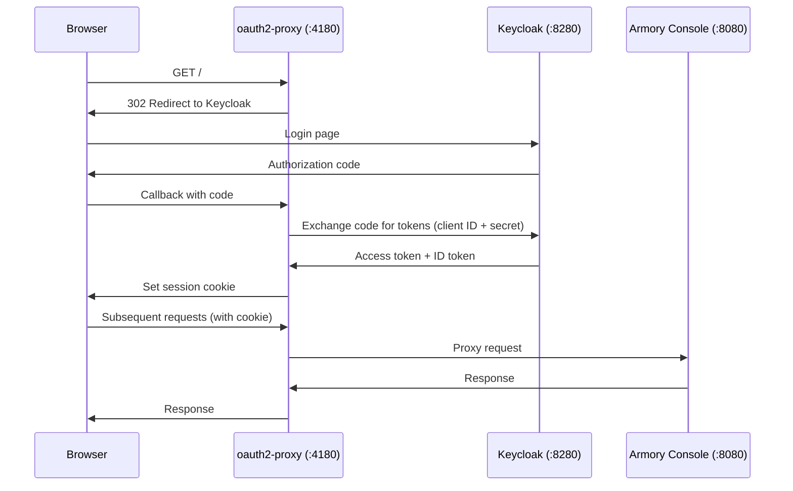

# Authenticate with oauth2-proxy (Client Secret)

Resources for the Authenticate with oauth2-proxy tutorial.

This tutorial uses [oauth2-proxy](https://oauth2-proxy.github.io/oauth2-proxy/) as a reverse proxy
that handles OIDC authentication with a **confidential client** (client ID + client secret)
instead of the PKCE flow used in the [auth-oidc](../auth-oidc/) tutorial.

## Setup

```bash
./setup auth-oidc-oauth2-proxy
```

During setup you will be prompted to add `127.0.0.1 keycloak` to `/etc/hosts` (requires sudo).
This is needed so that both your browser and the Kubernetes pods reach Keycloak at the same hostname.

## How it works



### PKCE vs Client Secret

| | auth-oidc (PKCE) | auth-oidc-oauth2-proxy (Client Secret) |
|---|---|---|
| Client type | Public | Confidential |
| Secret stored | — | Server-side (oauth2-proxy) |
| PKCE | S256 | Not used |
| Token exchange | Browser (SPA) | Server (oauth2-proxy) |
| Use case | SPAs, mobile apps | Server-side apps, reverse proxies |

## Credentials

| Service          | URL                     | Username | Password |
|------------------|-------------------------|----------|----------|
| Keycloak Admin   | http://keycloak:8280    | admin    | admin    |
| Keycloak Demo    | —                       | demo     | demo     |
| Armory Console   | http://localhost:4180   | demo     | demo     |

> **Note:** Access the console through oauth2-proxy at port 4180, not directly at port 8080.

## Teardown

```bash
./teardown auth-oidc-oauth2-proxy
```

This stops oauth2-proxy and Keycloak, and offers to remove the `/etc/hosts` entry.

## Troubleshooting

### oauth2-proxy not starting

Check that Keycloak is running and the realm is accessible:

```bash
curl http://keycloak:8280/realms/kannika
```

Check oauth2-proxy logs:

```bash
docker logs oauth2-proxy
```

### "Invalid redirect URI" error

Make sure the redirect URI in Keycloak matches exactly:
`http://localhost:4180/oauth2/callback`

Check the client configuration in the Keycloak admin console under
Clients → kannika-armory-proxy → Settings → Valid Redirect URIs.

### CORS errors in the browser

CORS errors usually mask a Keycloak-side issue.
Open the Keycloak URL directly (http://keycloak:8280/realms/kannika) to see the actual error.

### Console not loading behind oauth2-proxy

Verify oauth2-proxy can reach the console:

```bash
docker exec oauth2-proxy wget -qO- http://host.docker.internal:8080 2>&1 | head -5
```

If this fails, check that the Armory console is running:

```bash
kubectl get pods -n kannika-system
```
